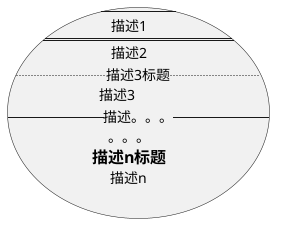
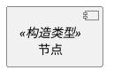
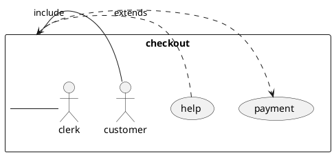
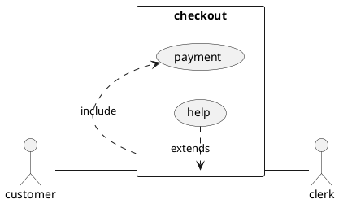
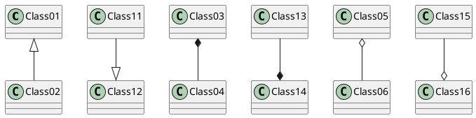

# 图

## 流程图

> 语法

```text

<mermaid>
graph 方向描述
    图表中的其他语句...
</mermaid>

```
> 特性

* 图方向

| 描述 | 含义 |
| --- | :-: |
| TB | 从上到下 |
| BT | 从下到上 |
| RL | 从右到左 |
| LR | 从左到右 |

* 节点定义

| 描述 | 含义 |
| --- | :-: |
| id[文字] | 矩形节点 |
| id(文字) | 圆角矩形节点 |
| id((文字)) | 圆形节点 |
| id>文字] | 右向旗帜状节点 |
| id{文字} | 菱形节点 |


* 节点间连线

| 描述 | 含义 |
| --- | :-: |
| > | 添加尾部箭头 |
| - | 不添加尾部箭头 |
| -- | 单线 |
| --text-- | 单线上加文字 |
| == | 粗线 |
| ==text== | 粗线加文字 |
| -.-| 虚线
| -.text.- | 虚线加文字 |

* 子图

语法：

```mermaid

subgraph 子图表名称
    子图表中的描述语句...
end

```

* 样式

语法：

```mermaid

style id 样式语句

```

| 描述 | 含义 |
| --- | :-: |
| fill | 填充颜色，值为十六进制颜色值 |
| stroke | 边框颜色，值为十六进制颜色值 |
| stroke-width | 边框粗细，值为像素值 |
| stroke-dasharray | 虚线长度，值为整数|

> 示例

<mermaid>
graph TB
  style id1 fill:#f9f, stroke:#333, stroke-width:4px;
  style id2 fill:#ccf, stroke:#f66, stroke-width:2px, stroke-dasharray: 2;
  id1(圆角矩形)--普通线-->id2[矩形]
  subgraph 子图表
      id2==粗线==>id3{菱形}
      id3-.虚线.->id4>右向旗帜]
      id3--无箭头---id5((圆形))
  end
</mermaid>

> 示例代码

```text

<mermaid>
graph TB
  style id1 fill:#f9f, stroke:#333, stroke-width:4px;
  style id2 fill:#ccf, stroke:#f66, stroke-width:2px, stroke-dasharray: 2;
  id1(圆角矩形)--普通线-->id2[矩形]
  subgraph 子图表
      id2==粗线==>id3{菱形}
      id3-.虚线.->id4>右向旗帜]
      id3--无箭头---id5((圆形))
  end
</mermaid>

```

## 序列图

> 语法

```mermaid

sequenceDiagram
  [参与者1][消息线][参与者2]:消息体
  ...

```

> 特性

* 参与者

```mermaid

sequenceDiagram
    participant 参与者 1
    participant 参与者 2
    ...
    participant 简称 as 参与者 3 #该语法可以在接下来的描述中使用简称来代替参与者 3

```

* 消息线

| 描述 | 描述 |
| --- | :-: |
| -> | 无箭头的实线 | 
| --> | 无箭头的虚线（） | 
| ->> | 有箭头的实线（发送消息） | 
| -->> | 有箭头的虚线（返回消息） | 
| -x | 末端为叉的实线（表示异步）| 
| --x | 末端为叉的虚线（表示异步）|

* 处理中

在消息线末尾增加 + ，则消息接收者进入当前消息的“处理中”状态； 
在消息线末尾增加 - ，则消息接收者离开当前消息的“处理中”状态。

* 标注

```mermaid

Note [位置表述] [参与者]: [标注文字]

```

其中位置表述可以为

| 描述 | 描述 |
| --- | :-: |
| right of | 右侧 |
| left of | 左侧 |
| over | 在当中，可以横跨多个参与者 |

* 循环

```mermaid 

loop 循环的条件
    循环体描述语句
end

```

* 判断

```mermaid

alt 条件 1 描述
    分支 1 描述语句
else 条件 2 描述 # else 分支可选
    分支 2 描述语句
else ...
    ...
end

```

如果遇到可选的情况，即没有 else 分支的情况(switch)，使用如下语法：

```mermaid

opt 条件描述
    分支描述语句
end

```

> 示例

<mermaid>
sequenceDiagram
  participant z as 张三
  participant l as 李四
  loop 日复一日
    z->>+l: 吃了吗您呐？
    l-->>-z: 吃了，您呢？
    activate z
    Note left of z: 想了一下
    alt 还没吃
      z-xl: 还没呢，正准备回去吃
    else 已经吃了
      z-xl: 我也吃过了，哈哈
    end
    opt 大过年的
      l-->z: 祝您新年好啊
    end
  end
</mermaid>

> 示例代码

```text

<mermaid>
sequenceDiagram
  participant z as 张三
  participant l as 李四
  loop 日复一日
    z->>+l: 吃了吗您呐？
    l-->>-z: 吃了，您呢？
    activate z
    Note left of z: 想了一下
    alt 还没吃
      z-xl: 还没呢，正准备回去吃
    else 已经吃了
      z-xl: 我也吃过了，哈哈
    end
    opt 大过年的
      l-->z: 祝您新年好啊
    end
  end
</mermaid>

```

## 甘特图

> 语法

```mermaid

gantt
  title [甘特图标题]
  dateFormat [时期格式，如YYYY-MM-DD]
  section [工作项1]
     [任务1描述]: [紧急度], [状态], [id], [开始日期], [结束日期|持续时间]
    【任务2描述]: [紧急度], [状态], [id], [开始日期], [结束日期|持续时间]
    ...
    任务n描述: [紧急度], [状态], [id], [开始日期], [结束日期|持续时间]

  section [工作项2]
     [任务1描述]: [紧急度], [状态], [id], [开始日期], [结束日期|持续时间]
    【任务2描述]: [紧急度], [状态], [id], [开始日期], [结束日期|持续时间]
    ...
    任务n描述: [紧急度], [状态], [id], [开始日期], [结束日期|持续时间]

  ...

  section [工作项n]
     [任务1描述]: [紧急度], [状态], [id], [开始日期], [结束日期|持续时间]
    【任务2描述]: [紧急度], [状态], [id], [开始日期], [结束日期|持续时间]
    ...
    任务n描述: [紧急度], [状态], [id], [开始日期], [结束日期|持续时间]
```

> 特性

* 日期格式，使用Moment.js 做日期转换

| 描述 | 示例 | 含义 |
| --- | :-: | :-: |
| YYYY | 2014| 4位或2位的年份数字|
| YY | 14 | 2位的年份数字 |
| Y | -25 | 任意能代表年份的数字或符号|
| M MM | 1..12 | 月份|
| D  DD | 1..31 | 日期 |

* 紧急度

| 描述 | 含义 |
| --- | :-: |
| crit | 紧急 |

* 状态

| 描述 | 含义 |
| --- | :-: |
| done | 已完成 |
| active | 进行中 |

* 持续时间单位

| 描述 | 含义 |
| --- | :-: |
| d | 天 |
| h | 小时 |
| m | 分钟 |
| s | 秒 |


> 示例

<mermaid>
gantt
  title 添加甘特图功能到mermaid
  dateFormat  YYYY-MM-DD
  section 工作项1
    已完成的任务                :done,    des1, 2014-01-06,2014-01-08
    正在进行的任务               :active,  des2, 2014-01-09, 3d
    尚未开始的任务1               :         des3, after des2, 5d
    尚未开始的任务2              :         des4, after des3, 5d
  section 紧急的工作项
    已完成的紧急任务 :crit, done, 2014-01-06,24h
    实现转换器和jison          :crit, done, after des1, 2d
    为转换器创建测试案例             :crit, active, 3d
    尚未开始的紧急任务        :crit, 5d
    为render创建测试案例           :2d
    添加到mermaid                      :1d
  section 文档工作项
    描述甘特图语法              :active, a1, after des1, 3d
    添加甘特图到示例页面     :after a1  , 20h
    添加其他的图到示例页面    :doc1, after a1  , 48h
  section 最后的工作项
    描述甘特图语法              :after doc1, 3d
    添加甘特图到示例页面      :20h
    添加其他的图到示例页面    :48h
</mermaid>

> 示例代码

```text

<mermaid>
gantt
  title 添加甘特图功能到mermaid
  dateFormat  YYYY-MM-DD
  section 工作项1
    已完成的任务                :done,    des1, 2014-01-06,2014-01-08
    正在进行的任务               :active,  des2, 2014-01-09, 3d
    尚未开始的任务1               :         des3, after des2, 5d
    尚未开始的任务2              :         des4, after des3, 5d
  section 紧急的工作项
    已完成的紧急任务 :crit, done, 2014-01-06,24h
    实现转换器和jison          :crit, done, after des1, 2d
    为转换器创建测试案例             :crit, active, 3d
    尚未开始的紧急任务        :crit, 5d
    为render创建测试案例           :2d
    添加到mermaid                      :1d
  section 文档工作项
    描述甘特图语法              :active, a1, after des1, 3d
    添加甘特图到示例页面     :after a1  , 20h
    添加其他的图到示例页面    :doc1, after a1  , 48h
  section 最后的工作项
    描述甘特图语法              :after doc1, 3d
    添加甘特图到示例页面      :20h
    添加其他的图到示例页面    :48h
</mermaid>

```

## 用例图

> 语法

```plantuml

@startuml
[开始方向] to [结束方向] direction
skinparam [变量] [值]
[参与者1][关系线][参与者2]

@enduml

```

> 特性

* 方向描述

有left、right、top、bottom

* 用例

语法：

```plantuml

(显示名称)
(显示名称) as (别名)
usecase 显示名称
usecase 显示名称 as 别名
usecase (显示\n名称) as 别名

```

示例：
@startuml
(第三)
(第一用例) as (first case)
usecase sec
usecase (第二\n用例) as sc
usecase 第四用例 as four
@enduml

* 角色

语法：

```plantuml

@startuml
:角色名称:
:角色名称: as 别名
actor 角色名称
actor 角色\n名称 as 别名
@enduml

```

示例：

@startuml
:第一角色:
:其他\n角色: as Men2  
actor Men3
actor :最后角色: as Men4
@enduml

* 用例描述

语法：




示例：

@startuml
usecase 测试用例 as "你能够
--
使用几行去定义你的用例.
你能够使用分隔符
==
并且能加上标题:
..结论..
这里允许使用这么长的描述
==还有多个标题==
你还可以使用这个风格的
--标题--
哈哈"
@enduml

* 关系

| 描述 | 含义 |
| --- | :-: |
| - -- --- | 双向关联关系 |
| -> --> ---> <- <-- <--- | 单向关联关系 |
|.> ..> ...> <. <.. <... | 单向依赖关系 |
| <\|--  --\|> | 继承关系 |
| . .. ... | 双向依赖关系 |


* 注释

语法：

```plantuml

@startuml
note [注释]  as [别名]
note [位置表述][注释]  as [别名]
[节点] ... [注释]  
@enduml

```
其中位置表述可以为

| 描述 | 描述 |
| --- | :-: |
| right of | 右侧 |
| left of | 左侧 |
| top of | 上侧 |
|bottom of| 下侧 |

示例：
@startuml
(使用应用) as (Use)
用户 -> (Start)
note "这个注释连接\n几个对象" as N2
(Start) ... N2
N2 ... (Use)
@enduml

* 构造类型

语法：



示例：
@startuml
User << Human >>
:Main Database: as MySql << Application >>
(Start) << One Shot >>
(Use the application) as (Use) << Main >>

User -> (Start)
User --> (Use)

MySql --> (Use)
@enduml

> 示例

@startuml
left to right direction
skinparam packageStyle rectangle
actor customer
actor clerk
rectangle checkout {
  customer -- (checkout)
  (checkout) .> (payment) : include
  (help) .> (checkout) : extends
  (checkout) -- clerk
}
@enduml

* 分组

使用[skinparam](http://plantuml.com/zh/skinparam)做分组

语法：



示例：

@startuml
skinparam packageStyle rectangle
actor customer
actor clerk
rectangle checkout {
  customer -- (checkout)
  (checkout) .> (payment) : include
  (help) .> (checkout) : extends
  (checkout) -- clerk
}
@enduml

> 示例代码



## 类图

> 语法

```plantuml

@startuml

class [类名1] {
  {static} [可访问性] [[属性]|[方法]()]: [[类型]|[返回类型]]
  {abstract} [可访问性] [方法](): [返回类型]
}

class [类名2] {
  {static} [可访问性] [[属性]|[方法]()]: [[类型]|[返回类型]]
  {abstract} [可访问性] [方法](): [返回类型]
}

类名1 [关系] 类名2

@enduml

```

> 特性

* 关系

列表：

| 描述 | 含义 |
| --- | :-: |
| <\|-- --\|>| 继承 |
| <\|.. ..\|>| 实现 |
| *-- --*| 组成 |
| o-- --o | 聚合 |
| - -- --- | 双向关联关系 |
| -> --> ---> <- <-- <--- | 单向关联关系 |
|.> ..> ...> <. <.. <... | 单向依赖关系 |
| . .. ... | 双向依赖关系 |

代码：



示例：

@startuml
Class01 <|-- Class02:继承 <
Class11 --|> Class12: 继承 >
Class03 *-- Class04: 组成 <
Class13 --* Class14: 组成 >
Class05 o-- Class06: 聚合 <
Class15 --o Class16: 聚合 >
@enduml

@startuml
Class07 .. Class08: 双向依赖
Class09 -- Class10: 双向关联
Class19 --> Class20: 单向依赖 >
Class21 <-- Class22: 单向依赖 <
Class23 <.. Class24: 单向依赖 <
Class25 ..> Class26: 单向依赖 >
@enduml


* 关系标注

语法:

```plantuml

@startuml
[类1] "【数量]" [关系] "[数量]" [类2]:[标注]
[类1] "【数量]" [关系] "[数量]" [类2]:[标注] [作用对象]
@enduml

```

示例：

@startuml
Class01 "1" *-- "n" Class02 : 包含
Class03 "1" *-- "n" Class04 : 包含 >
@enduml

* 添加属性或方法

语法：

```plantuml

@startuml
[类1] : [类型] [属性名]
[类2] : [方法名]()
class [类名] {
  类型 属性名
  返回类型 方法名(形参1, 形参1, ..., 形参n)
}

class [类名] {
  属性名: 类型
  方法名(参数1, 参数2, ... , 参数n): 返回类型
}
@enduml

```

示例：

@startuml
Object <|-- Flight

Object : equals()

class Flight {
   flightNumber : Integer
   departureTime : Date
   methods(param1): void
}
@enduml

* 可访问性

列表：
| 描述 | 含义 |
| --- | :-: |
| - | private |
| # | protected |
| ~ | package private |
| + | public |

语法：

```plantuml

@startuml

[可访问性] [属性名]

@enduml

```

示例：

@startuml

class Dummy {
 -field1: String
 #field2: String[]
 ~method1(): void
 +method2(param1): String
}

@enduml


* 抽象和静态

语法：

```plantuml
{static} [可访问性] [[属性]|[方法]()]: [[类型]|[返回类型]]
{abstract} [可访问性] [方法](): [返回类型]
```

示例：

@startuml

class Dummy {
 -field1:String
 {static}#field2: String[]
 {static}  ~method1():void
 {abstract} +method2(param1): String
}

@enduml

* 备注

你可以使用note left of , note right of , note top of , note bottom of这些关键字来添加备注。

你还可以在类的声明末尾使用note left, note right,note top, note bottom来添加备注。

此外，单独用note这个关键字也是可以的，使用 .. 符号可以作出一条连接它与其它对象的虚线。

示例：

@startuml
class Object << general >>
Object <|--- ArrayList

note top of Object : In java, every class\nextends this one.

note "This is a floating note" as N1
note "This note is connected\nto several objects." as N2
Object .. N2
N2 .. ArrayList

class Foo
note left: On last defined class

@enduml

示例代码：

```plantuml

@startuml
class Object << general >>
Object <|--- ArrayList

note top of Object : In java, every class\nextends this one.

note "This is a floating note" as N1
note "This note is connected\nto several objects." as N2
Object .. N2
N2 .. ArrayList

class Foo
note left: On last defined class

@enduml

```
* [更多高级特性](http://localhost:8080/demo/graph.html#%E7%B1%BB%E5%9B%BE)

> 示例

@startuml

class Dummy {
 -field1:String
 {static}#field2: String[]
 {static}  ~method1():void
 {abstract} +method2(param1): String
}

class Object << general >>

note top of Object : 在java中所有类\都是由这个类派生的.

Object <|-- Dummy: 派生 >

@enduml

> 示例代码

```plantuml

@startuml

class Dummy {
 -field1:String
 {static}#field2: String[]
 {static}  ~method1():void
 {abstract} +method2(param1): String
}

class Object << general >>

note top of Object : 在java中所有类\都是由这个类派生的.

Object <|-- Dummy: 派生 >

@enduml

```

## 状态图

> 简单状态

使用([*])开始和结束状态图。
使用-->添加箭头

示例代码：

```plantuml

@startuml

[*] --> State1
State1 --> [*]
State1 : this is a string
State1 : this is another string

State1 -> State2
State2 --> [*]

@enduml

```

示例：

@startuml

[*] --> State1
State1 --> [*]
State1 : this is a string
State1 : this is another string

State1 -> State2
State2 --> [*]

@enduml

> 合成状态

一个状态也可能是合成的，必须使用关键字state和花括号来定义合成状态。
示例代码：

```plantuml

@startuml
scale 350 width
[*] --> NotShooting

state NotShooting {
  [*] --> Idle
  Idle --> Configuring : EvConfig
  Configuring --> Idle : EvConfig
}

state Configuring {
  [*] --> NewValueSelection
  NewValueSelection --> NewValuePreview : EvNewValue
  NewValuePreview --> NewValueSelection : EvNewValueRejected
  NewValuePreview --> NewValueSelection : EvNewValueSaved
  
  state NewValuePreview {
	 State1 -> State2
  }
  
}
@enduml

```

示例：

@startuml
scale 350 width
[*] --> NotShooting

state NotShooting {
  [*] --> Idle
  Idle --> Configuring : EvConfig
  Configuring --> Idle : EvConfig
}

state Configuring {
  [*] --> NewValueSelection
  NewValueSelection --> NewValuePreview : EvNewValue
  NewValuePreview --> NewValueSelection : EvNewValueRejected
  NewValuePreview --> NewValueSelection : EvNewValueSaved
  
  state NewValuePreview {
	 State1 -> State2
  }
  
}
@enduml

> 长名字

也可以使用关键字state定义长名字状态。
示例代码：

```plantuml

@startuml
scale 600 width

[*] -> State1
State1 --> State2 : Succeeded
State1 --> [*] : Aborted
State2 --> State3 : Succeeded
State2 --> [*] : Aborted
state State3 {
  state "Accumulate Enough Data\nLong State Name" as long1
  long1 : Just a test
  [*] --> long1
  long1 --> long1 : New Data
  long1 --> ProcessData : Enough Data
}
State3 --> State3 : Failed
State3 --> [*] : Succeeded / Save Result
State3 --> [*] : Aborted
 
@enduml


```

示例：

@startuml
scale 600 width

[*] -> State1
State1 --> State2 : Succeeded
State1 --> [*] : Aborted
State2 --> State3 : Succeeded
State2 --> [*] : Aborted
state State3 {
  state "Accumulate Enough Data\nLong State Name" as long1
  long1 : Just a test
  [*] --> long1
  long1 --> long1 : New Data
  long1 --> ProcessData : Enough Data
}
State3 --> State3 : Failed
State3 --> [*] : Succeeded / Save Result
State3 --> [*] : Aborted
 
@enduml


> 并发状态

用-- or ||作为分隔符来合成并发状态。

示例代码：

```plantuml

@startuml
[*] --> Active

state Active {
  [*] -> NumLockOff
  NumLockOff --> NumLockOn : EvNumLockPressed
  NumLockOn --> NumLockOff : EvNumLockPressed
  --
  [*] -> CapsLockOff
  CapsLockOff --> CapsLockOn : EvCapsLockPressed
  CapsLockOn --> CapsLockOff : EvCapsLockPressed
  --
  [*] -> ScrollLockOff
  ScrollLockOff --> ScrollLockOn : EvCapsLockPressed
  ScrollLockOn --> ScrollLockOff : EvCapsLockPressed
}

@enduml

```

示例：

@startuml
[*] --> Active

state Active {
  [*] -> NumLockOff
  NumLockOff --> NumLockOn : EvNumLockPressed
  NumLockOn --> NumLockOff : EvNumLockPressed
  --
  [*] -> CapsLockOff
  CapsLockOff --> CapsLockOn : EvCapsLockPressed
  CapsLockOn --> CapsLockOff : EvCapsLockPressed
  --
  [*] -> ScrollLockOff
  ScrollLockOff --> ScrollLockOn : EvCapsLockPressed
  ScrollLockOn --> ScrollLockOff : EvCapsLockPressed
}

@enduml

> 箭头方向

使用->定义水平箭头，也可以使用下列格式强制设置箭头方向：

* -down-> (default arrow)
* -right-> or ->
* -left->
* -up->

示例代码：

```plantuml

@startuml

[*] -up-> First
First -right-> Second
Second --> Third
Third -left-> Last

@enduml

```

示例：

@startuml

[*] -up-> First
First -right-> Second
Second --> Third
Third -left-> Last

@enduml

> 注释

可以用 note left of, note right of, note top of, note bottom of 关键字来定义注释。

还可以定义多行注释。

示例代码：

```plantuml

@startuml

[*] --> Active
Active --> Inactive

note left of Active : this is a short\nnote

note right of Inactive
  A note can also
  be defined on
  several lines
end note

@enduml

```

示例：

@startuml

[*] --> Active
Active --> Inactive

note left of Active : this is a short\nnote

note right of Inactive
  A note can also
  be defined on
  several lines
end note

@enduml

> [更多特性](http://plantuml.com/zh/state-diagram)

## 更多
### [plantuml](http://plantuml.com/zh/index)
### [mermaid](https://mermaidjs.github.io)